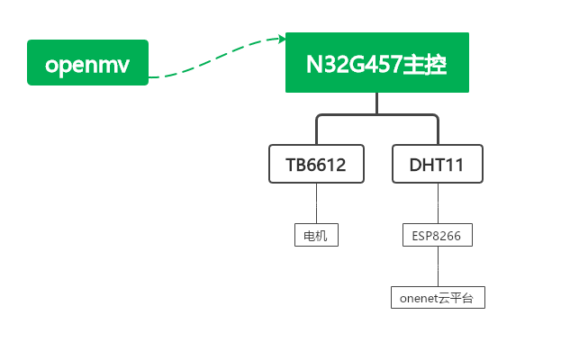
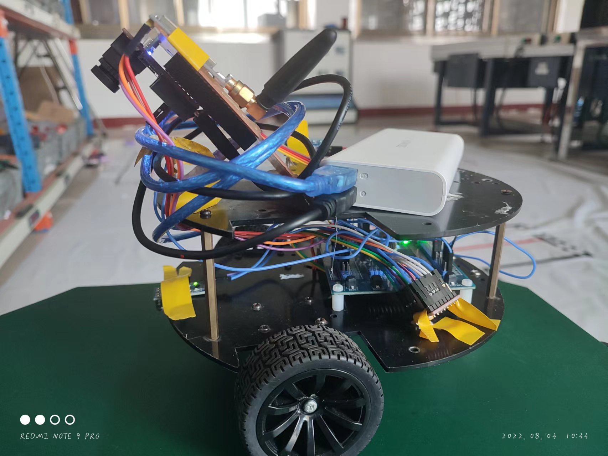

### 1. 作品背景

在畜牧业与种植业中，温度是影响产品质量的一个关键因素，因此需要密切的关注环境温度，而我们通常测量的是整体温度，整体温度的升高可能仅仅是由于某一部分地区温度的不正常所导致的，这时候就需要我们去对每一部分地区的温度进行排查，在每一块都布置传感器显然是不现实的，我们可以设计一辆环境温度检测车，对其下发路径信息，在车行驶的过程中对温度进行测量上传至云平台即可快速查找出是哪一部分温度发生了异常。

### 2.实现功能

1. 下发路径信息后车沿路线信息巡线行驶
2. 上传温度至onenet平台

### 3. 整体系统框架

### 4.RT-Thread使用情况

1. 线程的使用
2. 互斥量的使用
3. 完成量的使用
4. at_device:用于esp8266AT命令联网支持
5. OneNET：用于支持esp8266连接至onenet平台，里面包含了使用哪种协议连接至onenet云平台，本工程采用mqtt协议
6. dht11：用于支持dht11传感器读取周围的环境温度
7. cJSON：将dth传感器读取出的温度值封装成cSJON数据流上传至云平台
8. 绑定中断回调函数

### 5. 软硬件架构图

### 6.软件说明

1. 主程序主要采用5个线程：

   ###### 线程1： 串口3接收openmv发送过来的坐标数据并进行处理

###### 线程2：pid运算线程，将openmv传过来的坐标数据与设定数据进行比对处理，进行运算后加载到tb6612模块控制电机的停转

###### 线程3：onnet__mqtt,mqtt需要定时发送心跳包告知云平台自身的状态信息（与否仍然保持连接）

###### 线程4：DTH11模块读取环境温度，并上传到onenet平台

###### 线程5：红外模块通过上升沿中断的方式告知主控板停止条件是否已经达到

2. 线程1、2之间引入了互斥量来保护openmv传过来的坐标信息经过处理后才进行pid运算，在数据读取和处理阶段是不会进行pid运算的。
3. 线程4与线程5之间引入了完成量来判断是否达到了发送数据至云平台的条件。

### 7.作品完整图片

#### [演示视频](https://www.bilibili.com/video/BV1nB4y1r7G1?spm_id_from=333.1007.top_right_bar_window_history.content.click&vd_source=1030fc49793ffea59949728ba8e460ec)

